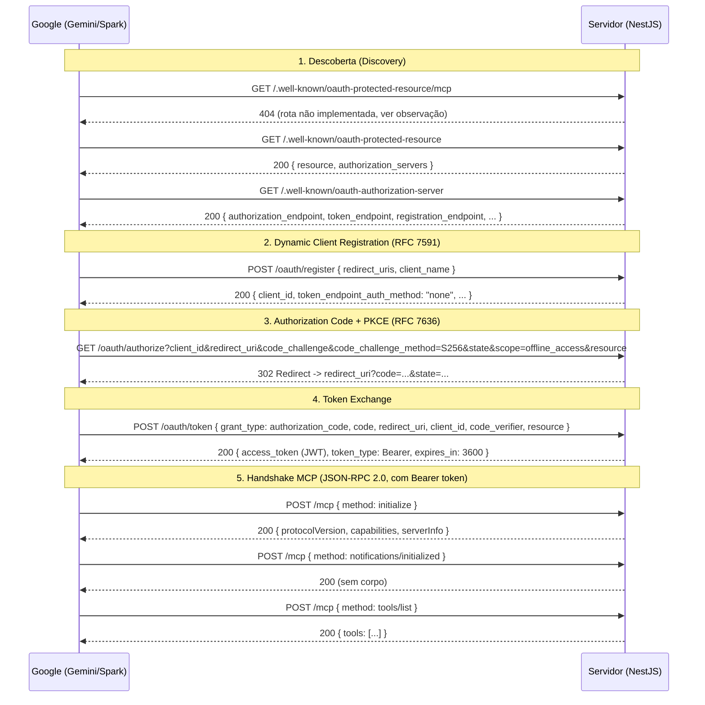

# gemini-spark-custom-mcp

Servidor **MCP (Model Context Protocol)** remoto, escrito em **NestJS**, projetado para ser conectado como *custom connector* no **Google Gemini / Google Spark** (e, por seguir os padrões abertos do MCP, em qualquer outro cliente MCP compatível: Claude, ChatGPT, etc).

O foco deste README é documentar **exatamente** o fluxo de autenticação e handshake que acontece entre o cliente MCP (Google) e este servidor — protocolo, rotas, headers, payloads e ordem das chamadas — para que qualquer pessoa consiga reimplementar este mesmo servidor em **qualquer linguagem ou framework**.

> Este projeto é um **POC (proof of concept)**. Há avisos de segurança importantes na seção [Limitações e avisos de segurança](#limitações-e-avisos-de-segurança) — leia antes de colocar em produção com dados reais.

---

## Sumário

- [Visão geral do protocolo](#visão-geral-do-protocolo)
- [Diagrama do fluxo completo](#diagrama-do-fluxo-completo)
- [Passo a passo detalhado](#passo-a-passo-detalhado)
- [Referência de rotas](#referência-de-rotas)
- [Detalhes de implementação (Authorization Server)](#detalhes-de-implementação-authorization-server)
- [Detalhes de implementação (MCP Server)](#detalhes-de-implementação-mcp-server)
- [Variáveis de ambiente](#variáveis-de-ambiente)
- [Como reimplementar em outra stack](#como-reimplementar-em-outra-stack)
- [Limitações e avisos de segurança](#limitações-e-avisos-de-segurança)
- [Rodando localmente / deploy](#rodando-localmente--deploy)

---

## Visão geral do protocolo

Um **custom connector** do Google Gemini/Spark que aponta para um MCP remoto precisa, na prática, implementar **dois protocolos sobrepostos**:

1. **OAuth 2.1 com PKCE + Dynamic Client Registration (DCR)** — usado pelo Google para descobrir o servidor de autorização, se registrar como client, obter consentimento e trocar um `code` por um `access_token`.
   - Baseado em: `RFC 8414` (Authorization Server Metadata), `RFC 9728` (Protected Resource Metadata), `RFC 7591` (Dynamic Client Registration), `RFC 7636` (PKCE).
2. **MCP (Model Context Protocol) sobre HTTP** — usado depois que o Google já tem um `access_token` válido, para conversar com o servidor via JSON-RPC 2.0 (`initialize`, `tools/list`, etc).

O servidor precisa expor **ambos** na mesma origem (`https://mcp-api.johnmarques.com.br` no exemplo dos logs), porque o Google descobre o Authorization Server **a partir da URL do próprio recurso MCP**.

---

## Diagrama do fluxo completo



---

## Passo a passo detalhado

Esta seção espelha exatamente a sequência observada nos logs de uma conexão bem-sucedida, ligando cada linha do log ao código que a gerou.

### 1. Discovery — o Google descobre quem é o Authorization Server

O cliente MCP do Google não sabe de antemão onde ficam as rotas de OAuth. Ele começa tentando ler **metadados bem conhecidos (well-known)** a partir da URL do recurso MCP (`https://mcp-api.johnmarques.com.br/mcp`):

**1a.** `GET /.well-known/oauth-protected-resource/mcp`
Essa variante (com o path do recurso, `/mcp`, no final) é uma tentativa do cliente de achar metadados *específicos daquele recurso* (padrão RFC 9728 quando o metadata é por-recurso). Este servidor **não implementa essa rota** — ela cai no 404 padrão do Nest, e o cliente automaticamente faz fallback para a rota "genérica" abaixo. Isso é esperado e inofensivo; não é obrigatório implementar essa variante para conectores custom.

**1b.** `GET /.well-known/oauth-protected-resource`
Implementada em `McpAuthController.protectedResource`. Resposta:
```json
{
  "resource": "https://mcp-api.johnmarques.com.br/mcp",
  "authorization_servers": ["https://mcp-api.johnmarques.com.br"]
}
```
Isso diz ao cliente: "o recurso MCP é essa URL, e quem autoriza o acesso a ela é este outro servidor" (aqui, a própria origem).

**1c.** `GET /.well-known/oauth-authorization-server`
Implementada em `McpAuthController.authServerMetadata`. Resposta:
```json
{
  "issuer": "https://mcp-api.johnmarques.com.br",
  "authorization_endpoint": "https://mcp-api.johnmarques.com.br/oauth/authorize",
  "token_endpoint": "https://mcp-api.johnmarques.com.br/oauth/token",
  "registration_endpoint": "https://mcp-api.johnmarques.com.br/oauth/register",
  "scopes_supported": ["offline_access"],
  "response_types_supported": ["code"],
  "grant_types_supported": ["authorization_code", "refresh_token"],
  "code_challenge_methods_supported": ["S256"],
  "token_endpoint_auth_methods_supported": ["none", "client_secret_post", "client_secret_basic"]
}
```
É este JSON que informa ao cliente **todas as demais rotas** do fluxo. Qualquer implementação em outra stack precisa devolver, no mínimo, esses campos com valores coerentes com as rotas realmente implementadas.

> Nos logs, o `user-agent` dessas três chamadas é literalmente `"Google"`, vindas de IPs do Google (`cf-connecting-ip` na faixa `108.177.x.x` / `104.22.x.x`, `cf-ipcountry: US`), passando por um Cloudflare na frente do servidor (`cdn-loop: cloudflare`).

### 2. Dynamic Client Registration (DCR) — RFC 7591

**`POST /oauth/register`**
Antes de poder autorizar, o cliente (o próprio Google, agindo em nome do usuário) se auto-registra como OAuth client. O `user-agent` aqui é `"OpenAuth"` (biblioteca cliente de OAuth usada internamente pelo Google), não mais `"Google"`.

Payload real observado no log:
```json
{
  "client_name": "Google",
  "redirect_uris": [
    "https://oauth-redirect-sandbox.googleusercontent.com/r/user_bound_custom-mcp-<id>-mcp-api_johnmarques_com_br",
    "https://oauth-redirect-test.googleusercontent.com/r/user_bound_custom-mcp-<id>-mcp-api_johnmarques_com_br",
    "https://oauth-redirect.googleusercontent.com/r/user_bound_custom-mcp-<id>-mcp-api_johnmarques_com_br",
    "https://oauth-redirect-sandbox.googleusercontent.com/a/user_bound_custom-mcp-<id>-mcp-api_johnmarques_com_br",
    "https://oauth-redirect-test.googleusercontent.com/a/user_bound_custom-mcp-<id>-mcp-api_johnmarques_com_br",
    "https://oauth-redirect.googleusercontent.com/a/user_bound_custom-mcp-<id>-mcp-api_johnmarques_com_br"
  ],
  "response_types": ["code"],
  "grant_types": ["authorization_code", "refresh_token"],
  "token_endpoint_auth_method": "client_secret_post"
}
```
Headers relevantes: `content-type: application/json`, `accept: application/json`.

Implementação (`McpAuthService.registerClient`): gera um `client_id` (`randomUUID()`), guarda `{ client_id, redirect_uris }` em memória, e responde no formato mínimo do RFC 7591:
```json
{
  "client_id": "ca493693-ae66-4940-9fdd-198f2190e3d0",
  "client_id_issued_at": 1787500000,
  "client_secret_expires_at": 0,
  "redirect_uris": ["..."],
  "client_name": "Google",
  "token_endpoint_auth_method": "none",
  "grant_types": ["authorization_code", "refresh_token"],
  "response_types": ["code"]
}
```
Pontos que importam para quem for reimplementar:
- `client_secret_expires_at: 0` = "o client não tem secret / não expira" (client público, autenticado só por PKCE).
- `token_endpoint_auth_method: "none"` é devolvido de propósito, mesmo o Google tendo pedido `client_secret_post` — este POC **não emite client_secret**, autenticação é feita 100% via PKCE.
- Este endpoint **não exige autenticação prévia** (é assim que DCR funciona) e, neste POC, **aceita qualquer client que se registre**, sem allowlist.

### 3. Authorization Request — Authorization Code + PKCE (RFC 7636)

**`GET /oauth/authorize`**
Depois de registrado, o navegador do usuário (aqui, uma aba aberta a partir do `gemini.google.com`, ver `referer` no log) é redirecionado para esta URL com querystring:

| Parâmetro | Exemplo no log | Descrição |
|---|---|---|
| `response_type` | `code` | Fluxo Authorization Code |
| `client_id` | `ca493693-ae66-4940-9fdd-198f2190e3d0` | Retornado no passo de DCR |
| `redirect_uri` | `https://oauth-redirect.googleusercontent.com/r/user_bound_custom-mcp-...` | Um dos `redirect_uris` registrados |
| `scope` | `offline_access` | Pede refresh token |
| `resource` | `https://mcp-api.johnmarques.com.br/mcp` | RFC 8707 — a que recurso o token vai servir |
| `code_challenge` | `ONNuHfco0ATUtikLivOhKBNyulCc1Jcvwhu5PO2r9Lc` | `BASE64URL(SHA256(code_verifier))` |
| `code_challenge_method` | `S256` | Único método suportado por este servidor |
| `state` | string opaca longa | Anti-CSRF, devolvida sem alteração |

Headers relevantes: é uma navegação real de browser (`user-agent: Mozilla/5.0 ... Chrome/151`, `sec-fetch-*`, `referer: https://gemini.google.com/`, `cf-ipcountry: BR` — o usuário de fato).

Implementação (`McpAuthController.authorize` + `McpAuthService.createAuthorizationCode`): **este POC não mostra nenhuma tela de login/consentimento** — ele aprova automaticamente para um único usuário hardcoded (`POC_USER`) e:
1. Gera um `code` (`randomUUID()`).
2. Guarda `{ client_id, redirect_uri, code_challenge, expiresAt: now + 5min }` em memória, indexado pelo `code`.
3. Responde com **302 redirect** para `redirect_uri` com `?code=...&state=...` anexados.

Log de exemplo do redirect gerado:
```
Redirecting to https://oauth-redirect.googleusercontent.com/r/user_bound_custom-mcp-...?code=78aff038-99f7-4a29-8e2b-2af551c9f01f&state=APvkAzEz...
```

> ⚠️ Em uma implementação real (não-POC), este é o ponto onde deveria existir uma tela de login e uma tela de consentimento explícito do usuário antes de emitir o `code`.

### 4. Token Exchange

**`POST /oauth/token`**
`user-agent: OpenAuth`, `content-type: application/x-www-form-urlencoded` no request real do Google (mas o Nest recebe já parseado como `Body`, então na prática este servidor aceita `x-www-form-urlencoded`/JSON conforme o parser configurado).

Payload real do log:
```json
{
  "grant_type": "authorization_code",
  "code": "78aff038-99f7-4a29-8e2b-2af551c9f01f",
  "redirect_uri": "https://oauth-redirect.googleusercontent.com/r/user_bound_custom-mcp-...",
  "client_id": "ca493693-ae66-4940-9fdd-198f2190e3d0",
  "code_verifier": "0okG54axyTyKoaQnbvE5e3iJKcaWTyuNRy6awt7VkAs",
  "resource": "https://mcp-api.johnmarques.com.br/mcp"
}
```

Implementação (`McpAuthService.exchangeToken`), nesta ordem exata:
1. Busca o `code` no map em memória. Se não existir ou já tiver passado dos 5 minutos → `invalid_grant`.
2. Confere que `redirect_uri` bate exatamente com o usado no `/oauth/authorize` → senão, `invalid_grant`.
3. **Valida PKCE**: `BASE64URL(SHA256(code_verifier)) === code_challenge` salvo anteriormente. Este é o passo que efetivamente autentica o client público (sem secret) — é **obrigatório** para o Google aceitar o token endpoint.
4. **Invalida o `code`** (`this.codes.delete(code)`) — uso único, não pode ser reaproveitado.
5. Assina um **JWT** (`jsonwebtoken`, `HS256` por padrão) com `{ sub: POC_USER.email }`, `expiresIn: '1h'`, usando `JWT_SECRET`.
6. Responde:
```json
{
  "access_token": "<jwt>",
  "token_type": "Bearer",
  "expires_in": 3600
}
```

> Repare que o `access_token` devolvido **é** o JWT em si (autocontido) — não há tabela de tokens no banco; a verificação depois é só `jwt.verify()` com o mesmo segredo. Não há emissão de `refresh_token` apesar de `scope=offline_access` ter sido pedido — ponto de melhoria caso queira sessões de longa duração sem repetir o fluxo completo.

### 5. Handshake MCP — agora autenticado

A partir daqui todo request para `/mcp` **precisa** do header:
```
Authorization: Bearer <access_token>
```
Isso é garantido pelo `McpAuthGuard`, aplicado com `@UseGuards(McpAuthGuard)` nas rotas `GET /mcp` e `POST /mcp`. Sem o header, ou com token inválido/expirado, o servidor responde **401** com:
```
WWW-Authenticate: Bearer realm="mcp", error="unauthorized"
```
(Esse header é o que faz clientes MCP compatíveis re-disparar o fluxo de discovery/OAuth automaticamente ao tomar 401.)

O corpo de cada chamada MCP é **JSON-RPC 2.0**. Sequência observada no log, feita via `POST /mcp`:

**`initialize`**
```json
{ "jsonrpc": "2.0", "id": 0, "method": "initialize", "params": { "protocolVersion": "2025-11-25", "capabilities": {}, "clientInfo": { "name": "mcp", "version": "0.1.0" } } }
```
Resposta do servidor (`AppController.handleMcpPost`):
```json
{ "jsonrpc": "2.0", "id": 0, "result": { "protocolVersion": "2024-11-05", "capabilities": {}, "serverInfo": { "name": "mcp-api", "version": "0.0.1" } } }
```
> Note a diferença de `protocolVersion` entre o que o cliente manda (`2025-11-25`) e o que o servidor devolve fixo (`2024-11-05`) — o servidor não faz negociação real de versão, apenas responde uma versão fixa suportada. Funciona porque o SDK do cliente tolera isso, mas numa implementação mais robusta o ideal é ecoar/negociar a versão do cliente.

**`notifications/initialized`** (sem `id` — é uma *notification* JSON-RPC, não espera resposta com corpo)
```json
{ "jsonrpc": "2.0", "method": "notifications/initialized" }
```
O servidor detecta `id === undefined` e responde apenas `200` vazio (`res.status(200).send()`), sem corpo JSON-RPC.

**`tools/list`**
```json
{ "jsonrpc": "2.0", "id": 1, "method": "tools/list" }
```
Resposta:
```json
{ "jsonrpc": "2.0", "id": 1, "result": { "tools": [] } }
```
Neste POC a lista de tools está vazia — é o próximo ponto óbvio de evolução do projeto (implementar tools reais no `switch (rpcRequest.method)`).

Outros métodos já com stub pronto no código: `prompts/list` → `{ "prompts": [] }`, `resources/list` → `{ "resources": [] }`. Qualquer método não mapeado cai no `default` e devolve `result: {}` (idealmente deveria devolver um erro JSON-RPC `Method not found`, ver seção de limitações).

**`GET /mcp` (SSE) — transporte legado**
Também guardado pelo mesmo `McpAuthGuard`. Existe para compatibilidade com clientes MCP mais antigos que usam **HTTP+SSE** em vez do transporte "Streamable HTTP" (`POST /mcp`). Ao conectar:
```
Content-Type: text/event-stream
Cache-Control: no-cache
Connection: keep-alive
```
e o primeiro evento enviado é:
```
event: endpoint
data: https://mcp-api.johnmarques.com.br/mcp/messages

```
seguido de um "ping" (linha de comentário `:\n\n`) a cada 15s para manter a conexão viva, até o client fechar a conexão (`req.on('close')`).

### 6. Polling contínuo

Depois do handshake, os logs mostram `GET /health` a cada ~10s e, periodicamente, `HEAD /mcp` seguido de todo o ciclo de discovery de novo (`/.well-known/...`). Isso é o cliente MCP do Google **revalidando** que o servidor ainda está de pé e que os metadados de OAuth não mudaram — não é necessário fazer nada especial para suportar isso além de manter `GET /health` respondendo rápido com `200`.

---

## Referência de rotas

| Método | Rota | Autenticado? | Descrição |
|---|---|---|---|
| `GET` | `/` | Não | Health/hello básico do Nest |
| `GET` | `/health` | Não | Usado por Coolify/Docker healthcheck e polling do Google |
| `GET` | `/.well-known/oauth-protected-resource` | Não | RFC 9728 — informa `resource` e `authorization_servers` |
| `GET` | `/.well-known/oauth-authorization-server` | Não | RFC 8414 — metadados do Authorization Server |
| `POST` | `/oauth/register` | Não | RFC 7591 — Dynamic Client Registration |
| `GET` | `/oauth/authorize` | Não (fluxo de usuário) | Emite `code` e faz 302 para `redirect_uri` |
| `POST` | `/oauth/token` | Não (autenticado via PKCE) | Troca `code` por `access_token` (JWT) |
| `GET` | `/mcp` | **Sim** (Bearer JWT) | Transporte SSE legado |
| `POST` | `/mcp` | **Sim** (Bearer JWT) | Transporte principal — JSON-RPC 2.0 |

---

## Detalhes de implementação (Authorization Server)

Arquivos: `src/mcp-auth/mcp-auth.controller.ts`, `src/mcp-auth/mcp-auth.service.ts`, `src/mcp-auth/mcp-auth.guard.ts`.

Estado guardado **em memória** (perdido a cada restart do processo):
- `clients: Map<client_id, { client_id, redirect_uris }>`
- `codes: Map<code, { client_id, redirect_uri, code_challenge, expiresAt }>`

Bibliotecas usadas:
- `crypto` (nativo do Node) — `randomUUID()` para `client_id`/`code`, `createHash('sha256')` para verificar o PKCE challenge.
- `jsonwebtoken` — assinar (`jwt.sign`) e verificar (`jwt.verify`) o `access_token`.

Verificação PKCE, em pseudocódigo (independente de linguagem):
```
hash = base64url( sha256(code_verifier) )
if hash !== code_challenge_salvo_no_authorize:
    rejeitar com "invalid_grant"
```

O `McpAuthGuard` é um guard genérico do Nest que roda antes de `GET /mcp` e `POST /mcp`: extrai `Authorization: Bearer <token>`, chama `jwt.verify`, e ou deixa passar ou lança `401 Unauthorized` (com o header `WWW-Authenticate` correto).

---

## Detalhes de implementação (MCP Server)

Arquivo: `src/app.controller.ts`. Sem SDK MCP — o JSON-RPC é tratado manualmente com um `switch` sobre `method`. Isso é intencional/simples para o POC, mas significa que:
- Não há validação de schema JSON-RPC (versão, formato do `id`, etc.).
- Não há suporte a *batch requests* (array de chamadas JSON-RPC).
- Erros não seguem o formato padrão `{ error: { code, message } }` do JSON-RPC — hoje qualquer método desconhecido devolve `result: {}` com `200`, quando o correto seria devolver um erro `-32601 Method not found`.

---

## Variáveis de ambiente

| Variável | Usado em | Default | Descrição |
|---|---|---|---|
| `API_PUBLIC_URL` | auth controller, `GET /mcp` | — (fallback `SERVER_URL`) | URL pública (com HTTPS) usada para montar `resource`, `issuer`, endpoints e o evento `endpoint` do SSE. **Precisa bater com o domínio real por trás do proxy/Cloudflare.** |
| `SERVER_URL` | idem | — (fallback `http://localhost:3001`) | Fallback caso `API_PUBLIC_URL` não esteja definida |
| `JWT_SECRET` | `mcp-auth.service.ts` | `poc-secret-troque-depois` | Segredo HS256 para assinar/verificar o `access_token`. **Trocar obrigatoriamente antes de qualquer uso real.** |
| `PORT` | `main.ts` | `3001` | Porta do servidor Express/Nest |

O app faz `app.set('trust proxy', 1)` e `app.enableCors({ origin: true, credentials: true })` — necessário porque roda atrás de Traefik/Coolify + Cloudflare (ver headers `x-forwarded-*` e `cdn-loop` nos logs).

---

## Como reimplementar em outra stack

Checklist mínimo, independente de linguagem/framework, para qualquer pessoa recriar este servidor (Python/FastAPI, Go, Express puro, Rails, etc.):

1. **Exponha os dois endpoints de discovery** na mesma origem do seu recurso MCP:
   - `GET /.well-known/oauth-protected-resource` → `{ resource, authorization_servers }`
   - `GET /.well-known/oauth-authorization-server` → metadados apontando para suas próprias rotas de `authorize`/`token`/`register`
2. **Implemente DCR** (`POST /oauth/register`): aceite `redirect_uris` (+ opcionalmente `client_name`), gere um `client_id` único, devolva-o junto com `token_endpoint_auth_method: "none"` se for operar como client público.
3. **Implemente `GET /oauth/authorize`**: valide `client_id`/`redirect_uri` contra o que foi registrado, exija `code_challenge` + `code_challenge_method=S256`, gere um `code` de uso único e curta duração (5 min é razoável), e faça **302** para `redirect_uri` com `code` e `state`.
   - Em produção real: troque a "auto-aprovação" por uma tela de login + consentimento explícito.
4. **Implemente `POST /oauth/token`**: valide `code` (existência, expiração, `redirect_uri` idêntico), valide PKCE (`sha256(code_verifier)` em base64url == `code_challenge`), invalide o `code` (uso único), e emita um `access_token` — pode ser um JWT autocontido (mais simples, sem estado) ou um token opaco com lookup em banco (mais fácil de revogar).
5. **Proteja as rotas MCP** exigindo `Authorization: Bearer <token>`; em caso de ausência/token inválido, devolva `401` com header `WWW-Authenticate: Bearer realm="mcp", error="unauthorized"` — isso é o que faz o cliente reiniciar o fluxo OAuth sozinho.
6. **Implemente o transporte MCP**: no mínimo `POST /mcp` recebendo JSON-RPC 2.0 e respondendo a `initialize`, `notifications/initialized` (sem corpo, é notification), `tools/list`, `resources/list`, `prompts/list`. Opcionalmente, `GET /mcp` com SSE para clientes legados.
7. **Mantenha `GET /health` respondendo rápido** — é chamado com frequência tanto por load balancer/orquestrador quanto pelo próprio cliente MCP como keep-alive.
8. Garanta que a variável equivalente a `API_PUBLIC_URL` reflita o **domínio público HTTPS real** — qualquer inconsistência entre o que vai nos metadados (`issuer`, `resource`, endpoints) e a URL efetivamente acessada quebra a descoberta.

---

## Limitações e avisos de segurança

Este repositório é um **POC** e tem, de propósito, atalhos que **não devem ir para produção com dados sensíveis** sem correção:

- **Usuário hardcoded** (`POC_USER`) e **sem tela de login/consentimento** — `GET /oauth/authorize` aprova automaticamente qualquer client registrado.
- **DCR aberto**: qualquer cliente pode se auto-registrar via `POST /oauth/register`, sem allowlist nem aprovação manual.
- **Estado 100% em memória** (`Map`) — `clients` e `codes` são perdidos a cada deploy/restart; não há persistência (apesar do `docker-compose.yml` já subir um Postgres, ele ainda não é usado pelo módulo de auth).
- **`JWT_SECRET` com default fraco** (`poc-secret-troque-depois`) — troque por um segredo forte via variável de ambiente antes de expor publicamente.
- **Sem `refresh_token`**: mesmo pedindo `scope=offline_access`, o token expira em 1h e não há renovação — o cliente precisa refazer o fluxo completo.
- **Erros JSON-RPC não seguem o spec** (`Method not found` deveria ser um erro `-32601`, não `result: {}`).

---

## Rodando localmente / deploy

```bash
# instalar dependências
pnpm install

# desenvolvimento (watch mode)
pnpm run start:dev

# build + produção
pnpm run build
node dist/main
```

Variáveis mínimas para rodar localmente em `.env`:
```
PORT=3001
API_PUBLIC_URL=http://localhost:3001
JWT_SECRET=troque-por-um-segredo-forte
```

Para expor publicamente (necessário para o Google conseguir alcançar as rotas), este projeto já inclui `Dockerfile` e `docker-compose.yml` prontos para deploy atrás de um proxy (Traefik/Coolify) com HTTPS — `API_PUBLIC_URL` **precisa** ser o domínio HTTPS público final, pois é ele que vai parar dentro dos metadados OAuth (`issuer`, `resource`, `authorization_endpoint`, etc).